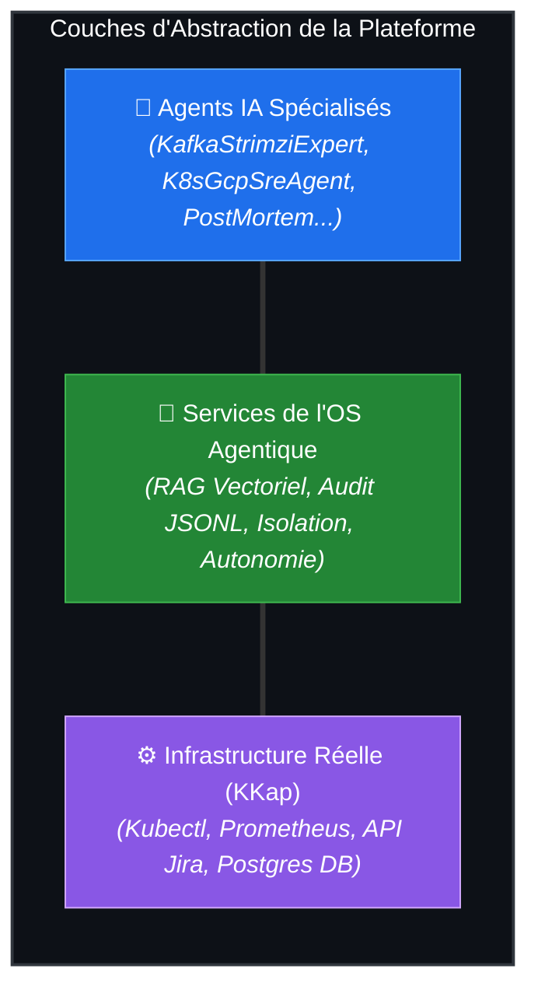
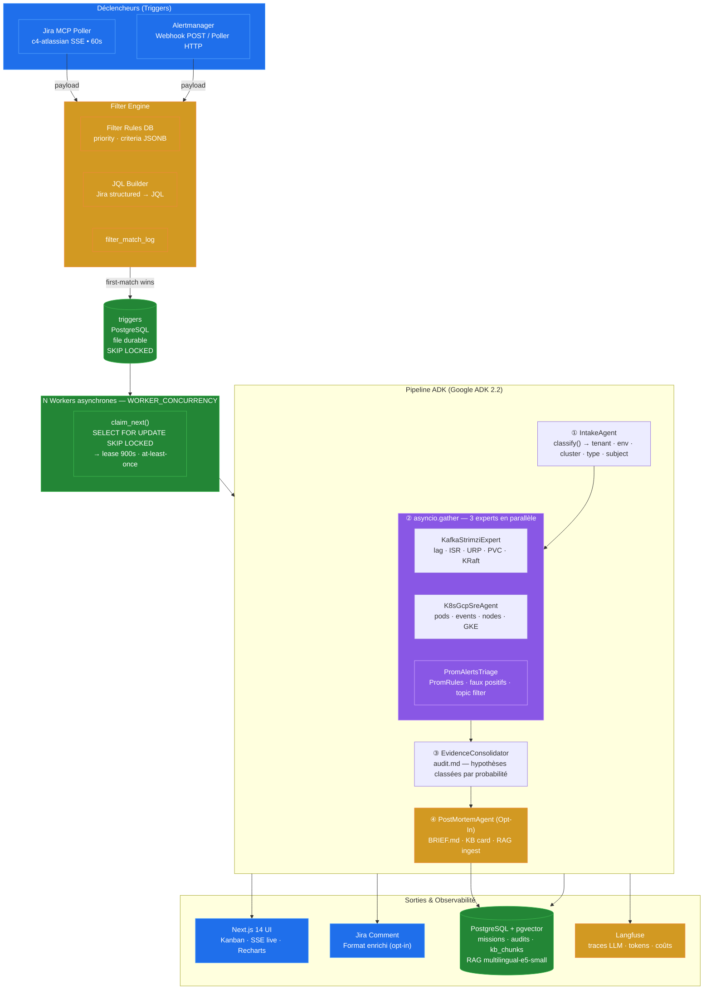
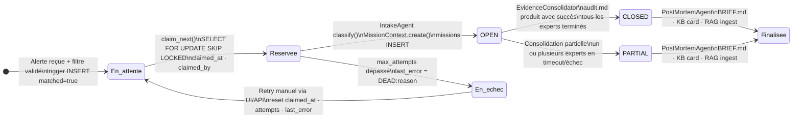
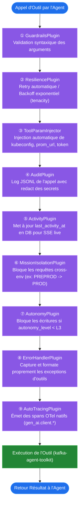
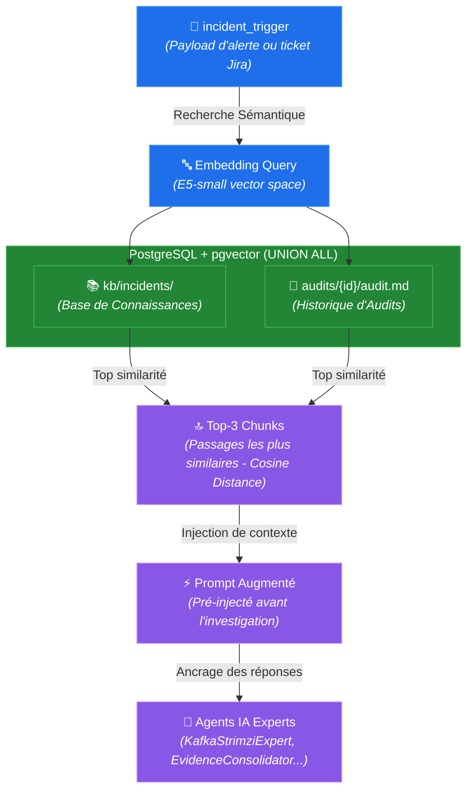
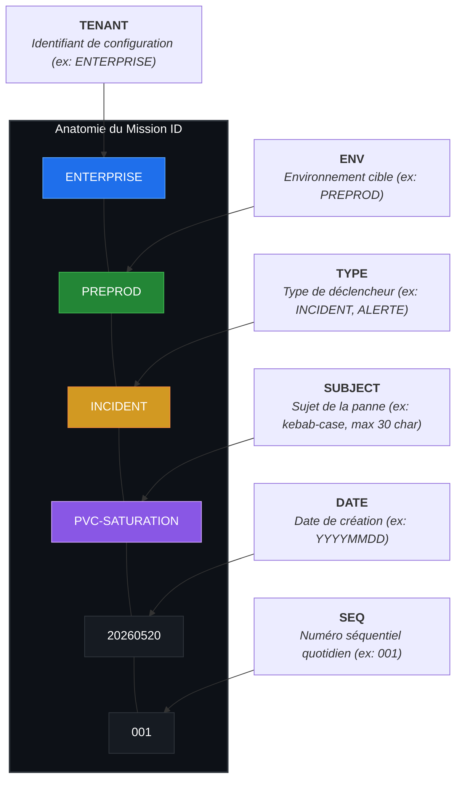

# Kafka Agentic Platform

[](https://opensource.org/licenses/Apache-2.0)
[](https://www.python.org/)
[](https://github.com/google/adk)
[](https://huggingface.co/intfloat/multilingual-e5-small)
[-orange)](https://github.com/arabaaoui/kafka-agentic-platform#niveaux-dautonomie)

> **OS Agentique Open-Source pour l'auto-triage et la capitalisation d'incidents Kafka/Strimzi/GKE.**
> Transforme des alertes brutes en hypothèses classées par probabilité et actionnables en **moins de 5 minutes**, avec isolation stricte des environnements, mémoire sémantique persistante et niveaux d'autonomie configurables.

---

## 📖 Vision & Philosophie

La **Kafka Agentic Platform** est un **système d'exploitation (OS) agentique** spécialisé. Contrairement à un chatbot passif ou à un simple script de monitoring, elle fournit une véritable infrastructure d'exécution pour une équipe d'agents IA hautement spécialisés.

### Qu'est-ce qu'un "OS Agentique" ?
De la même manière qu'un OS traditionnel fournit des appels système (syscalls) pour gérer l'isolation des processus, la sécurité, l'accès au disque ou les connexions réseau, la **Kafka Agentic Platform** fournit aux agents IA les services de bas niveau dont ils ont besoin pour agir :
* **Gestion de sessions et d'état** : Maintien de l'historique de raisonnement.
* **Sécurité & Isolation** : Barrières strictes empêchant tout agent de déborder de son environnement cible.
* **Moteur d'Audit** : Traçabilité absolue de chaque appel d'outil consigné en JSONL avec masquage automatique des secrets.
* **RAG & Mémoire Sémantique** : Injection automatique de l'historique des incidents similaires avant le début de l'investigation.
* **Orchestration Multi-Agent** : Concurrence managée pour éviter la latence.



---

## 🧩 Les 2 Couches du Système

Le projet est conçu de manière modulaire selon une séparation stricte des responsabilités :

1. **`kafka-agent-toolkit` (Stateless Core)** :
   Une bibliothèque Python pure et sans état (DB, HTTP). Elle regroupe les primitives de diagnostic métier (`lag_correlation`, `pvc_forecast`, `cluster_health`, `prom_query`), les schémas Pydantic de validation et le chargeur de system prompts (`SKILL.md`). Elle est hautement testable unitairement.
2. **`kafka-agentic-platform` (Stateful OS - Ce Dépôt)** :
   Le coeur opérationnel de l'application. Il contient l'API FastAPI, le worker asynchrone, le moteur de filtres, la file d'attente robuste, l'orchestrateur de pipeline Google ADK 2.x, la base de données PostgreSQL + pgvector pour le RAG, et l'interface utilisateur Next.js.

---

## 🏛️ Architecture Globale

Le flux de traitement est entièrement événementiel. Les alertes brutes sont filtrées, placées dans une file d'attente transactionnelle, analysées en parallèle par des agents experts, puis consolidées sous forme d'audit dynamique consultable en temps réel.



---

## 🚦 Cycle de Vie d'une Mission (State Machine)

La transition des états d'une investigation est managée de bout en bout, assurant une résilience complète face aux redémarrages de l'application ou aux indisponibilités temporaires des dépendances :



---

## ⚙️ Filter Engine & File Durable (SKIP LOCKED)

### 1. Filter Engine
Le moteur de filtres permet d'éviter la surcharge de la plateforme en ignorant les alertes non pertinentes. Il évalue les événements selon des règles stockées en base de données (`FilterRule`) :
* **Scope Jira** : Traduit des critères structurels complexes en requêtes JQL valides.
* **Scope Alertmanager** : Valide le payload contre des expressions régulières sur les labels d'alerte (ex: `alertname=~"Kafka.*"`).
* **First-Match Wins** : Les règles sont triées par priorité. Dès qu'une règle matche, l'évaluation s'arrête et le trigger est créé en base.

### 2. File d'attente transactionnelle (SKIP LOCKED)
Pour garantir un traitement robuste de type **at-least-once** sans dépendre d'un broker de messages externe lourd, la plateforme utilise une file d'attente persistante PostgreSQL :
* **Évitement des verrous** : Les workers interrogent la table `triggers` via `SELECT FOR UPDATE SKIP LOCKED`, ce qui permet une concurrence parfaite sans contention.
* **Système de Lease** : Lorsqu'un worker prend une tâche, il définit un timestamp `claimed_at`. Si le worker crash, le lease expire après 15 minutes (`LEASE_SECONDS=900`) et un autre worker peut reprendre la tâche.
* **Backoff Exponentiel** : En cas d'échec transitoire, les tâches sont ré-essayées avec un délai croissant jusqu'à `max_attempts` (défaut: 3), avant de basculer à l'état `DEAD` pour intervention humaine.

---

## 🧠 Les 6 Agents Experts et leurs Outils

Chaque agent est défini par un fichier **`SKILL.md`** qui fait office de contrat opérationnel, dictant son rôle, son domaine de compétence et les règles de mise en page de ses rapports.

| Agent | Rôle / Prompt Contrat | Outils Utilisés | Output Produit |
|---|---|---|---|
| **IntakeAgent** | Classificateur LLM pur. Analyse le trigger et extrait les métadonnées techniques. | Aucun (LLM seul) | `MissionContext` (tenant, env, cluster, type, subject) |
| **KafkaStrimziExpert** | Expert Apache Kafka & Strimzi Operator. Analyse l'état logique de la plateforme. | `lag_correlation`, `pvc_forecast`, `cluster_health`, `prom_query`, `k8s_client` | Rapport analytique Kafka (lag, ISR, URP, brokers) |
| **K8sGcpSreAgent** | Ingénieur SRE Kubernetes & GCP. Audite l'infrastructure physique et l'état de GKE. | `cluster_health`, `k8s_client` (get/describe/logs/top), `prom_query` | Rapport d'infrastructure (pods, événements K8s, saturation CPU/Mem) |
| **PromAlertsTriage** | Expert en métrologie et faux-positifs Prometheus. Vérifie la légitimité de l'alerte. | `promrule_audit`, `prom_query` | Audit de règle d'alerte et vérification de requêtes PromQL |
| **EvidenceConsolidator** | Synthétiseur transverse. Regroupe les analyses pour en extraire des conclusions actionnables. | Aucun (LLM seul) | **`audit.md`** : Rapport unifié contenant une table des hypothèses classées par probabilité |
| **PostMortemAnalyst** | Capitalisateur d'incident. Rédige les synthèses exécutives à froid et enrichit le RAG. | `KBCardWriter` | **`BRIEF.md`** (5 sections), création/mise à jour de cartes KB dans `kb/incidents/` |

### Méthodologie "Plan-and-Solve"
Tous les agents d'investigation sont contraints par une discipline de raisonnement stricte injectée dans leur prompt (`_INVESTIGATION_METHOD`) :
1. **Intentionnalité** : L'agent doit exprimer ce qu'il cherche à tester *avant* chaque appel d'outil (ex : *"Je vais appeler pvc_forecast pour vérifier si le broker 1 est saturé"*).
2. **Résilience** : Une erreur de commande (timeout, kubeconfig invalide) est traitée comme une information et non comme un plantage. L'agent l'enregistre et cherche une alternative.
3. **Validation croisée** : L'agent doit activement chercher des preuves contradictoires avant d'émettre une conclusion définitive (*"Cette erreur de pod ne viendrait-elle pas plutôt d'un souci de node pressure ?"*).

---

## 🔌 Chaîne de Plugins Native ADK 2.x (9 Plugins)

Chaque action entreprise par un agent (appel d'outil, appel LLM) traverse une chaîne ordonnée de **9 plugins** héritant de `google.adk.plugins.BasePlugin`. Cette architecture centralise les contrôles de sécurité et d'observabilité sans polluer le code métier des agents.



---

## 🧠 RAG & Mémoire Sémantique (Auto-Learning)

Pour pallier le manque de contexte interne des LLMs de commodité et éviter qu'ils n'hallucinent des résolutions, la plateforme embarque une mémoire vectorielle persistante (RAG) alimentée en continu.



### 1. Dual Vector Sources
La base de données vectorielle interroge simultanément deux sources de données :
* **La Base de Connaissances Locale (`kb/incidents/`)** : Environ 30 fiches de diagnostics rédigées par des experts techniques sous forme de fichiers Markdown dotés d'un frontmatter YAML (contenant symptômes, causes racines, résolutions recommandées).
* **L'Historique des Missions Passées (`audits/`)** : Les rapports de consolidation `audit.md` générés automatiquement lors des incidents précédents, permettant de repérer les récurrences.

### 2. Choix du Modèle d'Embedding : `multilingual-e5-small`
La plateforme utilise le modèle `intfloat/multilingual-e5-small` pour des raisons architecturales rigoureuses :
* **Taille Ultra-Légère** : Avec ~117 millions de paramètres (~460 Mo sur disque), il s'exécute de manière ultra-rapide sur CPU standard (20 à 80 ms par batch) sans nécessiter de GPU coûteux.
* **Support Natif du Français** : Indispensable pour respecter la **politique de langue (ADR-005)** de la plateforme (`PLATFORM_LANG=fr` : rapports rédigés en français, mais termes techniques conservés en anglais).
* **Haute Qualité de Récupération (Retrieval)** : Conçu spécifiquement pour la recherche sémantique, il utilise des préfixes stricts (`query:` pour la recherche et `passage:` pour l'indexation) assurant un taux de pertinence très élevé.

### 3. Mode Offline Sécurisé (Production GKE)
Les environnements de production d'entreprise sont isolés d'Internet. La plateforme fonctionne de manière 100% autonome et hermétique :
* Au build-time (avec accès internet), le modèle d'embedding est téléchargé et sauvegardé dans l'image Docker à l'emplacement `/models/multilingual-e5-small`.
* Au runtime, la variable d'environnement `EMBEDDING_MODEL_PATH=/models/multilingual-e5-small` force le chargement du modèle depuis le disque local, bloquant tout appel réseau externe vers HuggingFace Hub.

---

## 🆔 Anatomie du Mission ID

Chaque investigation reçoit un identifiant de mission immuable, hautement structuré et lisible pour l'humain. Il est utilisé dans toutes les traces de diagnostic, les répertoires de fichiers et les commentaires de tickets de tracking :



---

## 🔒 Niveaux d'Autonomie (Guardrails Opérationnels)

Pour protéger l'intégrité de la plateforme de production, l'accès en écriture est rigoureusement encadré par le composant `AutonomyPlugin` :

```
┌──────────┬────────────────────────┬────────────────────────────────────────┬─────────────────────────────┐
│ Niveau   │ Nom                    │ Capacités                              │ Bloqué par                  │
├──────────┼────────────────────────┼────────────────────────────────────────┼─────────────────────────────┤
│ L1       │ Read-only strict       │ prom_query, cluster_health (describe)  │ Tous les writes             │
│ L2 (Def) │ Read + logs            │ L1 + kubectl logs / top                │ topic_create, scale, restart│
│ L3       │ Supervisé              │ Actions réversibles avec validation    │ Actions destructives directes│
│ L4       │ Full autonomy          │ Toutes les actions (y compris writes)  │ Aucune restriction          │
└──────────┴────────────────────────┴────────────────────────────────────────┴─────────────────────────────┘
```

* **Production** : Recommandé à L1 ou L2.
* **Hors-Production (Lab / Preprod)** : Peut être élevé à L3 pour tester des capacités d'auto-remédiation sous contrôle humain.

---

## 📂 Structure des Répertoires

```
kafka-agentic-platform/
├── agents/                        ← Agents de décision ADK (LlmAgent)
│   ├── base.py                    ← BaseAgent : chargement SKILL.md, application plugins, persistance
│   ├── intake/                    ← LLM classificateur de contexte d'entrée
│   ├── kafka_strimzi_expert/      ← Diagnostics logiques Kafka (partitions, lag, ISR, brokers)
│   ├── k8s_gcp_sre/               ← Diagnostics physiques Kubernetes (pods, PVCs, GKE)
│   ├── prom_alerts_triage/        ← Analyse des alertes Prometheus et détection des faux-positifs
│   ├── evidence_consolidator/     ← Consolidateur global -> génère le rapport classé audit.md
│   ├── post_mortem_analyst/       ← Génère BRIEF.md, fiches KB incidents, et pousse en base sémantique
│   └── pipeline/
│       ├── orchestrator.py        ← PipelineOrchestrator : exécution séquentielle/parallèle
│       ├── durable_queue.py       ← Gestion de la file d'attente transactionnelle
│       └── worker.py              ← Worker asynchrone : polling, heartbeat, retry
│
├── api/                           ← API HTTP FastAPI
│   ├── main.py                    ← Point d'entrée de l'application & lifespan des workers
│   └── routes/
│       ├── missions.py            ← Endpoints d'administration et d'historique des missions (CRUD)
│       ├── triggers.py            ← Suivi et rejeu des déclencheurs
│       ├── filter_rules.py        ← Gestion des règles du Filter Engine
│       ├── kb.py                  ← Visualisation des fiches de connaissances vectorisées
│       ├── metrics.py             ← Métriques d'observabilité Prometheus (lag, durée, erreurs)
│       └── admin.py               ← Diagnostics de santé interne de l'OS agentique
│
├── core/                          ← Services transverses partagés
│   ├── mission.py                 ← Modèles de données de mission et format de Mission ID
│   ├── models.py                  ← Définitions des schémas de base de données (12 tables)
│   ├── plugins.py                 ← Configuration de la suite des 9 plugins ADK
│   ├── filter_engine.py           ← Moteur d'évaluation des règles d'entrée
│   ├── rag_ingest.py              ← Logique de chunking Markdown et d'ingestion pgvector
│   ├── embeddings.py              ← Service d'embedding multilingue (singleton lazy)
│   ├── mem0_bridge.py             ← Index de recherche vectoriel cosine distance
│   ├── kb_writer.py               ← Écriture physique et indexation des cartes KB incidents
│   ├── tenant.py                  ← Registre d'isolation multi-tenant
│   └── gcp.py                     ← Authentification GKE et usurpation d'identité GSA
│
├── triggers/                      ← Adaptateurs d'entrée asynchrones
│   ├── alertmanager_webhook.py    ← Réception immédiate des alertes Alertmanager (HTTP POST)
│   ├── alertmanager_poller.py     ← Collecteur d'alertes par scrutation d'API Prometheus
│   └── jira_mcp_poller.py         ← Intégration Jira Atlassian via pont MCP Server
│
├── web/                           ← Interface Utilisateur Next.js 14 (Tailwind + Recharts)
│   ├── app/
│   │   ├── page.tsx               ← Dashboard de pilotage central (Statistiques + Kanban)
│   │   ├── missions/              ← Liste tabulaire et Kanban interactif
│   │   ├── missions/[id]/         ← Rapport d'audit consolidé, logs d'outils et timeline
│   │   ├── triggers/              ← Historique détaillé des événements d'entrée
│   │   └── kb/                    ← Moteur d'exploration des fiches de connaissances
│   └── components/
│       ├── OpsStrip.tsx           ← Barre d'état des workers de l'OS en temps réel
│       ├── MissionsKanban.tsx     ← Tableau de bord glissant des statuts d'investigation
│       └── AuditViewer.tsx        ← Moteur de rendu du rapport final audit.md
│
├── deploy/                        ← Artefacts de déploiement (Docker, Docker Compose, Chart Helm)
├── evals/                         ← Suite d'évaluation promptfoo pour l'intégration continue (gate >= 80%)
├── kb/incidents/                  ← Répertoire des fiches de diagnostic Markdown de référence
├── tenants/                       ← Fichiers de configuration multi-tenant de référence
└── tests/                         ← Tests unitaires, d'intégration et E2E
```

---

## 🔌 API REST Reference

| Verbe | Endpoint | Description |
|---|---|---|
| `GET` | `/v1/missions` | Récupère la liste de toutes les missions d'investigation. |
| `GET` | `/v1/missions/kanban` | Retourne la structure du Kanban de suivi en une seule requête optimisée. |
| `GET` | `/v1/missions/{id}` | Détail complet d'une mission (état, rapports intermédiaires d'agents). |
| `POST` | `/v1/missions/{id}/finalize` | Force l'exécution manuelle de l'agent de post-mortem pour capitalisation. |
| `DELETE` | `/v1/missions/{id}` | Supprime proprement une mission et purge en cascade ses artefacts disques. |
| `GET` | `/v1/triggers` | Liste de tous les déclencheurs reçus par la plateforme. |
| `POST` | `/v1/triggers/{id}/retry` | Réintroduit un déclencheur en échec (`DEAD`) dans la file d'attente. |
| `GET` | `/v1/filter-rules` | Liste toutes les règles actives du Filter Engine. |
| `POST` | `/v1/filter-rules` | Ajoute une nouvelle règle de filtrage d'événements. |
| `GET` | `/v1/kb` | Explore sémantiquement les fiches de connaissances. |
| `GET` | `/metrics` | Métriques d'usage internes exposées pour le scraping Prometheus. |
| `GET` | `/healthz` | Statut de vitalité (nombre de workers actifs, profondeur de file d'attente). |

---

## 🛠️ Installation & Démarrage

### Prérequis Système
* **Docker & Docker Compose v2+**
* **Python 3.11+** équipé du gestionnaire de paquets ultra-rapide [**`uv`**](https://docs.astral.sh/uv/)
* La bibliothèque [**`kafka-agent-toolkit`**](https://github.com/arabaaoui/kafka-agent-toolkit) clonée localement dans le même dossier parent.

### Séquence de Démarrage Rapide

```bash
# 1. Cloner les dépôts frères dans un même dossier de travail
git clone https://github.com/arabaaoui/kafka-agentic-platform.git
git clone https://github.com/arabaaoui/kafka-agent-toolkit.git

# 2. Configurer les variables d'environnement
cd kafka-agentic-platform
cp .env.example .env

# Éditer le fichier .env et renseigner vos clés et tokens :
# - Clé API LLM (ex: GOOGLE_API_KEY)
# - Connexions d'observabilité (LANGFUSE_SECRET_KEY...)
# - Token d'accès Jira (JIRA_MCP_TOKEN...)

# 3. Lancer les services d'infrastructure (Postgres + Redis + Langfuse)
cd deploy
docker compose up postgres redis langfuse -d

# 4. Appliquer les migrations de base de données PostgreSQL + pgvector
cd ..
uv run alembic upgrade head

# 5. Démarrer le backend d'investigation et l'interface Next.js
cd deploy
docker compose --profile app up -d
```

### Vérification du Déploiement

| Service | Adresse Locale | Fonctionnalité |
|---|---|---|
| **Portail UI Next.js** | [http://localhost:3000](http://localhost:3000) | Visualisation Kanban, suivi des rapports d'audits et charts. |
| **API Backend FastAPI** | [http://localhost:8001](http://localhost:8001) | Swagger interactif disponible à l'adresse `/docs`. |
| **Langfuse Console** | [http://localhost:3001](http://localhost:3001) | Suivi analytique des coûts de tokens, traces LLM et latences. |

---

## 🧪 Validation & Tests

La plateforme suit des exigences d'ingénierie de qualité logicielle rigoureuses :

```bash
# Executer la suite complète de tests de non-régression back-end (180+ tests)
uv run pytest tests/unit/ -q

# Lancer la validation Promptfoo pour la détection de secrets et alignement LLM
cd evals
bash run_evals.sh

# Lancer l'analyse statique de typage sur le code TypeScript de l'interface
cd ../web
npx tsc --noEmit --skipLibCheck
```

---

## 🌍 Mentions Open-Source & Contribution

Ce projet est distribué sous licence libre et ouverte.

### Licence
Le projet est sous licence **Apache License 2.0**. Vous pouvez librement utiliser, modifier et distribuer ce logiciel dans des environnements commerciaux ou personnels, à condition de conserver la mention de copyright et la licence d'origine. Consulter le fichier `LICENSE` pour plus de détails.

### Contributions
Les contributions de la communauté de l'ingénierie Infrastructure / DevOps sont les bienvenues ! Pour proposer une amélioration :
1. Créez un fork du projet.
2. Créez une branche dédiée à votre fonctionnalité (`git checkout -b feature/nouvelle-idee`).
3. Assurez-vous que tous les tests unitaires passent (`pytest`) et que le linter ne lève aucune erreur.
4. Soumettez une Pull Request décrivant précisément l'apport de vos modifications.

---

*Développé avec passion pour simplifier la vie des équipes InfraOps / SRE en charge des plateformes Apache Kafka.*
