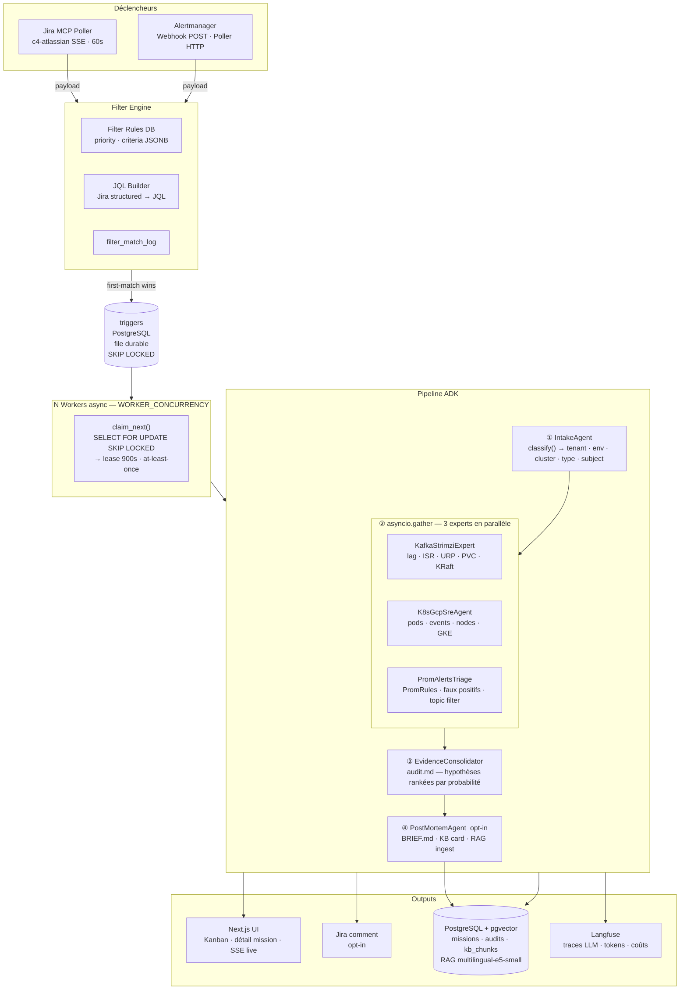
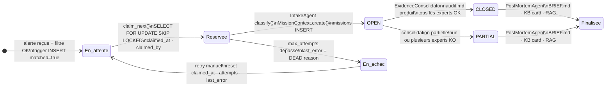
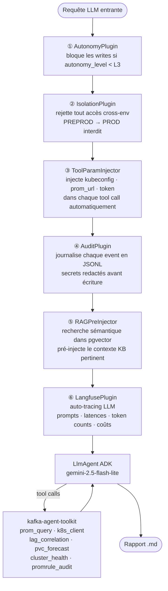
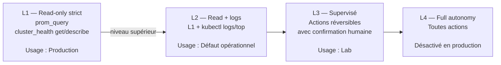

# kafka-agentic-platform

**OS agentique** pour l'auto-triage et la capitalisation d'incidents Kafka/Strimzi/GKE.

Transforme des alertes brutes en hypothèses rankées et actionnables en < 5 minutes, avec isolation stricte des environnements, mémoire RAG persistante et niveau d'autonomie configurable.

> **Stack :** Google ADK 2.2 · LiteLLM · FastAPI · PostgreSQL + pgvector · Next.js 14 · gemini-2.5-flash-lite

---

## Architecture globale



---

## Cycle de vie d'une mission



---

## Chaîne de plugins ADK

Chaque agent exécute les 6 plugins suivants dans l'ordre garanti par `build_plugin_list()` :



---

## Mission ID

Chaque mission reçoit un identifiant structuré et humainement lisible :

```
CARREFOUR - PREPROD - INCIDENT - PVC-SATURATION - 20260520 - 001
    │           │         │             │               │       │
 TENANT        ENV      TYPE         SUBJECT          DATE    SEQ
               │                  kebab-case
           lab · preprod         max 30 chars
             · prod
```

---

## Niveaux d'autonomie



---

## Lien kafka-agent-toolkit

```mermaid
graph LR
    subgraph KAP["kafka-agentic-platform  (ce repo)"]
        IA["IntakeAgent"]
        KE["KafkaStrimziExpert"]
        SRE["K8sGcpSreAgent"]
        PT["PromAlertsTriage"]
        ORC["PipelineOrchestrator"]
    end

    subgraph KAT["kafka-agent-toolkit"]
        PQ["prom_query"]
        KC["k8s_client"]
        LC["lag_correlation"]
        PF["pvc_forecast"]
        CH["cluster_health"]
        PA["promrule_audit"]
        KB["kb/ — schémas + CRUD"]
        SK["skills/ — SKILL.md loader\npromql_kafka · promql_k8s"]
    end

    KAP -->|"import uv workspace\ndépendance unidirectionnelle"| KAT
```



---

## Structure des répertoires

```
kafka-agentic-platform/
│
├── agents/                        ← Agents ADK (LlmAgent)
│   ├── base.py                    ← BaseAgent : SKILL.md + plugins + persist
│   ├── intake/                    ← LLM pur — classifieur tenant/env/type/subject
│   ├── kafka_strimzi_expert/      ← lag · URP · ISR · PVC · KRaft · brokers
│   ├── k8s_gcp_sre/               ← pods · events · nodes · PVC GKE · ressources
│   ├── prom_alerts_triage/        ← PromRules · faux positifs · topic filter
│   ├── evidence_consolidator/     ← synthèse → audit.md hypothèses rankées
│   ├── post_mortem_analyst/       ← BRIEF.md + KB card + RAG ingest
│   └── pipeline/
│       ├── orchestrator.py        ← PipelineOrchestrator.handle()
│       ├── durable_queue.py       ← claim_next() SKIP LOCKED · lease · retry
│       └── worker.py              ← poll DB · heartbeat · backoff exponentiel
│
├── api/                           ← FastAPI application
│   ├── main.py                    ← create_app() · lifespan (workers + pollers)
│   └── routes/
│       ├── missions.py            ← /v1/missions · kanban · lifecycle · finalize
│       ├── triggers.py            ← /v1/triggers · retry
│       ├── filter_rules.py        ← /v1/filter-rules CRUD
│       ├── kb.py                  ← /v1/kb browse
│       ├── metrics.py             ← GET /metrics Prometheus
│       └── admin.py               ← GET /healthz · worker_count · queue_depth
│
├── core/                          ← Services partagés
│   ├── mission.py                 ← MissionContext · MissionStatus · MissionType
│   ├── models.py                  ← SQLAlchemy ORM — 12 tables
│   ├── plugins.py                 ← build_plugin_list() — 6 ADK BasePlugin
│   ├── filter_engine.py           ← FilterEngine · FilterRule · JQL builder
│   ├── rag_ingest.py              ← ingest_kb_card() · ingest_audit()
│   ├── embeddings.py              ← EmbeddingService (multilingual-e5-small)
│   ├── mem0_bridge.py             ← RAGIndex — recherche sémantique pgvector
│   ├── kb_writer.py               ← KBCardWriter — create/update/index
│   ├── tenant.py                  ← TenantRegistry · TenantConfig · EnvConfig
│   └── gcp.py                     ← GCPTokenProvider — ADC / GSA impersonation
│
├── triggers/                      ← Sources d'entrée
│   ├── alertmanager_webhook.py    ← POST /webhooks/alertmanager (202 immédiat)
│   ├── alertmanager_poller.py     ← poll HTTP périodique
│   └── jira_mcp_poller.py         ← SSE c4-atlassian MCP
│
├── web/                           ← Frontend Next.js 14 + React 18
│   ├── app/
│   │   ├── page.tsx               ← Dashboard (OpsStrip + Kanban)
│   │   ├── missions/              ← Liste table | Kanban 4 colonnes
│   │   ├── missions/[id]/         ← Détail + lifecycle + audit.md + agents
│   │   ├── triggers/              ← Historique triggers
│   │   ├── kb/                    ← Explorer KB cards
│   │   └── monitoring/            ← Métriques temps réel (Recharts)
│   └── components/
│       ├── OpsStrip.tsx           ← workers · queue · oldest pending · dead count
│       ├── MissionsKanban.tsx     ← En attente / Réservée / Terminée / En échec
│       ├── MissionLifecycle.tsx   ← Timeline trigger → mission
│       └── AuditViewer.tsx        ← Rendu Markdown audit.md
│
├── migrations/                    ← Alembic — 14 migrations
├── kb/incidents/                  ← Knowledge Base Markdown (cartes incidents)
├── tenants/                       ← Configs multi-tenant YAML
├── evals/                         ← Harness Promptfoo (CI gate ≥ 80%)
├── tests/                         ← unit/ + integration/ + e2e/
└── deploy/
    ├── docker-compose.yml         ← postgres · redis · backend · web (profiles: app, lab)
    ├── Dockerfile.backend
    └── helm/                      ← Chart Helm K8s
```

---

## API REST

| Méthode | Endpoint | Description |
|---------|----------|-------------|
| `GET` | `/v1/missions` | Liste des missions (filtrable status/env/tenant) |
| `GET` | `/v1/missions/kanban` | Vue Kanban 4 colonnes en une requête |
| `GET` | `/v1/missions/{id}` | Détail mission + agents + audit |
| `GET` | `/v1/missions/{id}/lifecycle` | Timeline trigger → mission |
| `POST` | `/v1/missions/{id}/finalize` | Déclenche PostMortemAgent |
| `DELETE` | `/v1/missions/{id}` | Suppression mission + cascade |
| `GET` | `/v1/triggers` | Historique triggers |
| `POST` | `/v1/triggers/{id}/retry` | Relance un trigger DEAD |
| `GET` | `/v1/filter-rules` | Liste des règles de filtrage |
| `POST` | `/v1/filter-rules` | Crée une règle |
| `GET` | `/v1/kb` | Browse KB cards |
| `GET` | `/metrics` | Métriques Prometheus scrape |
| `GET` | `/healthz` | Santé plateforme (worker_count · queue_depth · dead_count) |

---

## Installation

### Prérequis

- Docker Compose v2
- Python 3.11+ + [uv](https://docs.astral.sh/uv/)
- [`kafka-agent-toolkit`](https://github.com/arabaaoui/kafka-agent-toolkit) cloné en parallèle
- GCP credentials (ADC ou Service Account)

### Démarrage

```bash
# 1. Cloner les deux repos côte à côte (uv workspace)
git clone https://github.com/arabaaoui/kafka-agentic-platform
git clone https://github.com/arabaaoui/kafka-agent-toolkit

# 2. Configurer l'environnement
cp kafka-agentic-platform/.env.example kafka-agentic-platform/.env
# Remplir : GOOGLE_API_KEY, JIRA_MCP_TOKEN, LANGFUSE_SECRET_KEY, ...

# 3. Démarrer l'infrastructure (postgres + redis + langfuse)
cd kafka-agentic-platform/deploy
docker compose up postgres redis langfuse -d

# 4. Appliquer les migrations DB
cd .. && uv run alembic upgrade head

# 5. Démarrer backend + frontend
cd deploy && docker compose --profile app up
```

| Service | URL |
|---------|-----|
| Frontend (Next.js) | http://localhost:3000 |
| Backend (FastAPI) | http://localhost:8001 |
| Langfuse | http://localhost:3001 |
| API docs | http://localhost:8001/docs |

### Tests

```bash
# Tests unitaires back-end (186 tests)
uv run pytest tests/unit/ -q

# Évaluations LLM (gate ≥ 80%)
cd evals && bash run_evals.sh

# Vérification TypeScript front-end
cd web && npx tsc --noEmit --skipLibCheck
```

---

→ [kafka-agent-toolkit](https://github.com/arabaaoui/kafka-agent-toolkit) — bibliothèque stateless des primitives métier
